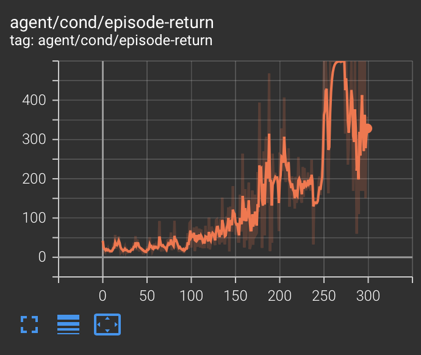
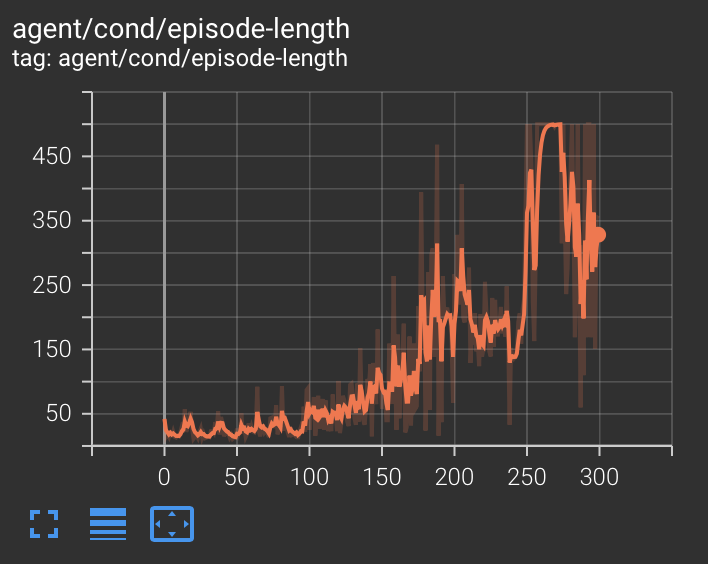
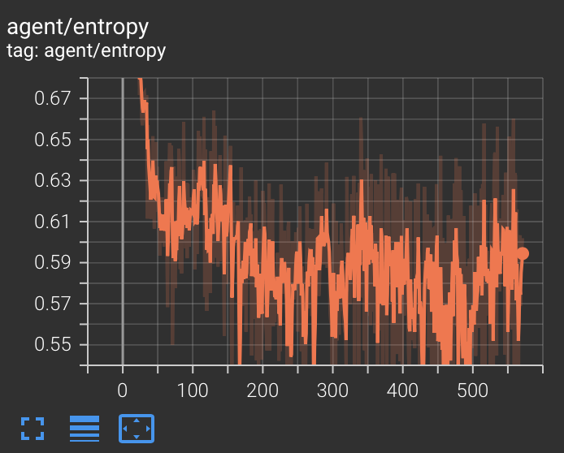

# reinforcement_learning_with_tensorforce

---
## CartPole
---

#### CartPole-early

#### CartPole-middle

#### CartPole-late

#### Tensorboard Experiment Summaries 
(episode returns, episode lengths, action distributions and agent entropy)

---
## LunarLander
---

#### LunarLander-early

#### LunarLander-middle

#### LunarLander-late

