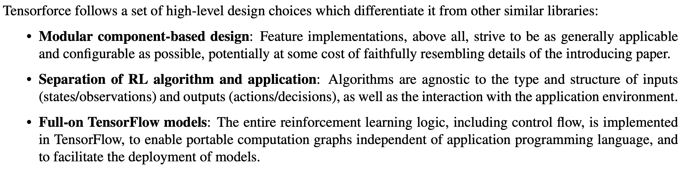
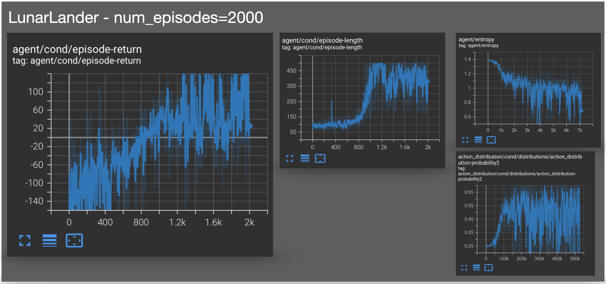

# reinforcement_learning_with_tensorforce

---
## Easily Accessible Reinforcement Learning
---
Tensorforce is an exciting prospect. For years now 'standard' ML techniques have been supported with easily accessible frameworks such as scikit-learn, keras, tensorflow, pytorch etc. but there has not really been a serious answer for reinforcement learning. Sure one could go into the lower level detail of say pytorch and tensorflow and setup a reinforcement learning solution but it feels like this is far apart from the easy-to-use scikit-learn interface for example. This is why tensorforce and others (mushroom rl, rllib, stable baselines, openai baselines etc.) are so exciting, in that they hope to bring reinforcement learning solutions with easy-to-use higher level abstractions of complicated lower level details, intended for a productionized format.  

This project opts for `tensorforce` rather than the other rl frameworks mentioned above mainly for it's excellent documentation, high level design principles and active community support (Gitter). 

---
## CartPole
---

#### CartPole - early

#### CartPole - middle

#### CartPole - late

#### CartPole - Plots taken from TensorBoard Summaries
(episode returns, episode lengths, agent entropy and action distributions)

 

---
## LunarLander
---

#### LunarLander - early

#### LunarLander - middle

#### LunarLander - late

#### LunarLander - Plots taken from TensorBoard Summaries
(episode returns, episode lengths, agent entropy and action distributions)

 
