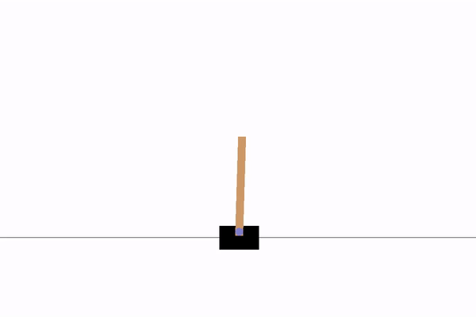
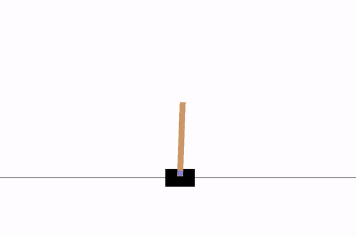
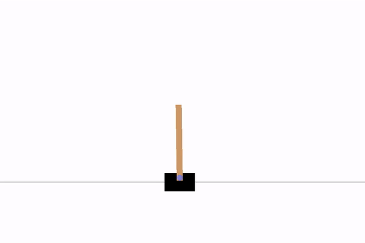
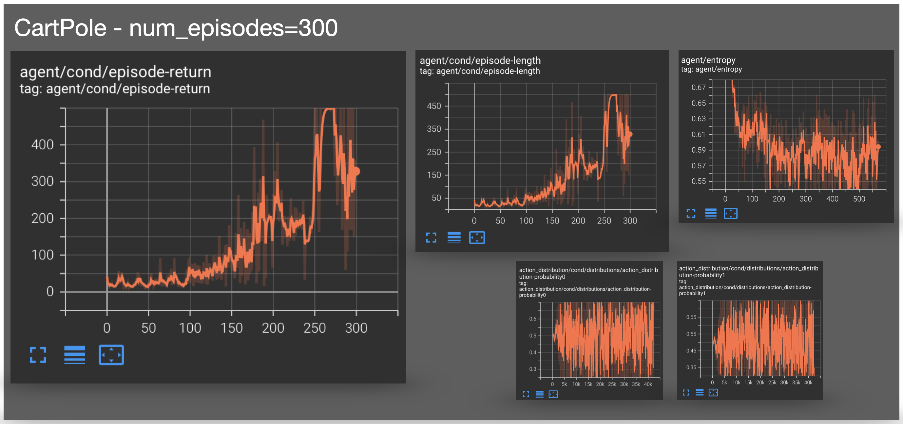
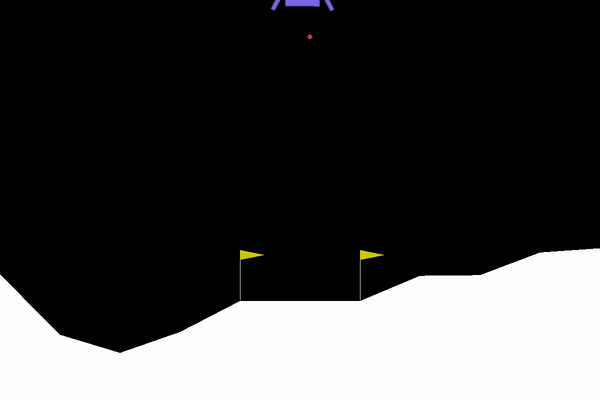
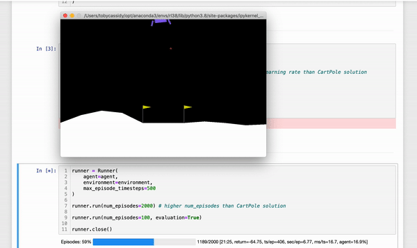

# reinforcement_learning_with_tensorforce

---
## CartPole
---

#### CartPole - early

#### CartPole - middle

#### CartPole - late

#### CartPole - Important plots taken from TensorBoard
(episode returns, episode lengths, action distributions and agent entropy)

---
## LunarLander
---

#### LunarLander - early

#### LunarLander - middle

#### LunarLander - late

