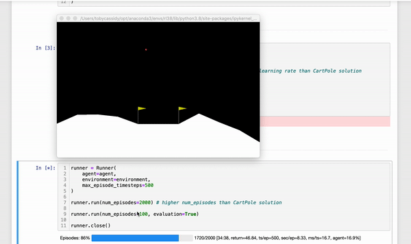

# reinforcement_learning_with_tensorforce

---
## Easily Accessible Reinforcement Learning
---
Tensorforce is an exciting prospect. For years now 'standard' ML techniques have been supported with easily accessible frameworks such as scikit-learn, keras, tensorflow, pytorch etc. but there has not really been a serious answer for reinforcement learning. Sure one could go into the lower level detail of say pytorch and tensorflow and setup a reinforcement learning solution but it feels like this is far apart from the easy-to-use scikit-learn interface for example. This is why tensorforce and others (mushroom rl, rllib, stable baselines, openai baselines etc.) are so exciting, in that they hope to bring reinforcement learning solutions with easy-to-use higher level abstractions of complicated lower level details, intended for a productionized format.  

This project opts for `tensorforce` rather than the other rl frameworks mentioned above mainly for it's excellent documentation, high level design principles and active community support (Gitter). 

There are three main components in setting up a tensorforce solution (as shown in the walkthroughs of this repo):
  1. Initializing an Environment - with [supported envs](https://github.com/tensorforce/tensorforce/tree/master/tensorforce/environments) or a custom env.
  2. Initializing an Agent - in both CartPole and LunarLander walkthroughs the agent being used is `agent='tensorforce'` with small tweaks to the optimizer learning_rate and num_episodes training, to highlight point two above in the high level design of tensorforce (i.e. Separation of RL algorithm and application). The documentation claims this agent to be 'highly configurable' and 'basis for a broad class of deep reinforcement learning agents which act according to a policy parametrized by a neural network, leverage a memory module for periodic updates based on batches of experience, and optionally employ a baseline/critic/target policy for improved reward estimation.'  Also the `objective='policy_gradient'` was set for both walkthroughs, which maximizes the log-likelihood or likelihood-ratio scaled by the target reward value. 
  3. Execution with a Runner utility - whilst highly recommended to use the runner utility for training, one could use a simple training for loop, using the act-observe interaction pattern if more detailed control is desireable. 

---
## CartPole
---

#### CartPole - early

#### CartPole - middle

#### CartPole - late

#### CartPole - Plots taken from TensorBoard Summaries
(episode returns, episode lengths, agent entropy and action distributions)

 

---
## LunarLander
---

#### LunarLander - early

#### LunarLander - middle

#### LunarLander - late

#### LunarLander - Plots taken from TensorBoard Summaries
(episode returns, episode lengths, agent entropy and action distributions)

 
